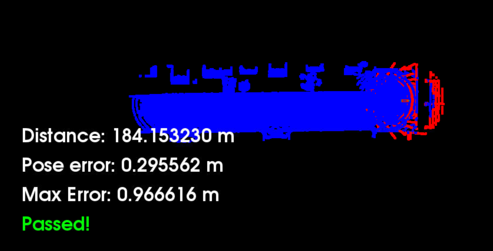
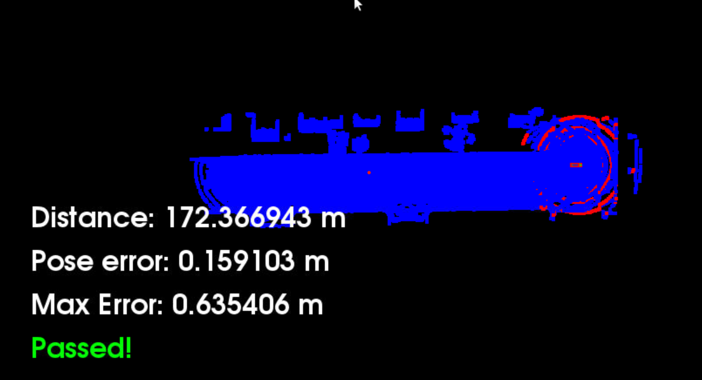

# Scan Matching Localisation
This project is done in case of Self-Driving Car Engineer Nanodegree<br/>
https://www.udacity.com/course/self-driving-car-engineer-nanodegree--nd013

## Description

The purpose of this project is to implement, use and compare two localisation algorithms (ICP and NDT) in case of a car equipped with a lidar. The target of the application is to keep the max pose error below 1.2m for 170 travelled meters. For testing our algorithms, we are using Carla Simulator to provide lidar scan at regular intervals. In addition, we already have the map (extracted from Carla Simulator) to use for Scan Matching (otherwise it will be a SLAM(Simultaneous Localisation And Mapping) use case)


### Installation

This project uses Udacity workspace of the project "Scan Matching Localization" of the Lesson 3 "Localization" of the Self-Driving Car Engineer Nanodegree program.

### Usage

Firstly, to use ScanMatchingLocalisation, Carla simulator needs to be running in the background. To do it, running the following commands:

```
su - student # Ignore Permission Denied, if you see student@ you are good
cd /home/workspace/c3-project
./run_carla.sh
```

Meanwhile, Carla Simulator is running in a dedicated prompt, compile and run ScanMatchingLocalization application using the following commands:

```
cd /home/workspace/c3-project
cmake .
make
./cloud_loc
```

## NDT vs ICP
### Algorithm Selection

To select the algorithm to use for the Scan Matching Localisation application set the value of 
<pre>
<code>
#define USE_NDT 0  // 0=Use ICP Algorithm and 1=Use NDT Algorithm
</code>
</pre>

### Results Analysis

Once all parameters tuned at the best (at least for this use case), we notice that the NDT algorithm allows to keep max pose error lower than ICP.

Nevertheless, during ICP execution, there are only few values that really impacting the max pose error, most of the values are much lower. It might be due to some unexpecting use cases, badly handled use case or some outliers.

#### ICP


#### NDT


The most challenging part of this project was to find the correct parameters of each algorithm. However, the ICP algorithm was easier to tune to pass the test. If I resume, the ICP algorithm is easier to tune to obtain correct values but perform poorly against correctly tuned NDT. An NDT algorithm is more complex to tune to obtain good results but can outperform ICP once the correct parameters found.

It raises one question, are those parameters specific to these situations/map or not. Will it perform as well on a different map?

# Acknowledgement

Thanks to Udacity Mentors Help section and all students that faced the same issues as me to help me to find the best parameters for different algorithms.